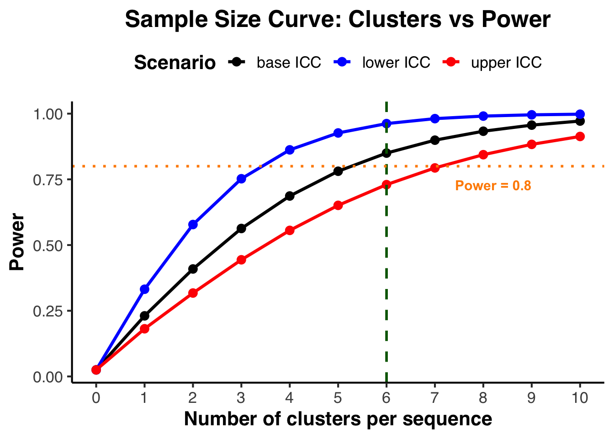

# ComBaScale stepped-wedge cluster randomized trial (SW-CRT)

Plot data exported from <https://clusterrcts.shinyapps.io/rshinyapp/>

**Packages**


::: {.cell}

```{.r .cell-code}
req_pkgs <- c("dplyr",
              "ggplot2",
              "readr",
              "tidyr")
install_if_missing <- function(pkgs){
  for(p in pkgs){
    if(!requireNamespace(p, quietly=TRUE)){
      install.packages(p, repos="https://cloud.r-project.org")
    }
    library(p, character.only=TRUE)
  }
}
install_if_missing(req_pkgs)

# set global RNG seed for reproducibility
set.seed(20250809)
```
:::


## Sample size curve


::: {.cell}

```{.r .cell-code}
# Read your data
df <- read_csv("save_curve.csv")

# Keep only the needed columns
df <- df %>%
  select(no_clusters_x, power_x, power_x_l, power_x_u)

# Reshape to long format for ggplot
df_long <- df %>%
  pivot_longer(cols = c(power_x, power_x_l, power_x_u),
               names_to = "scenario",
               values_to = "power")

# Map custom labels and colors
df_long$scenario <- factor(df_long$scenario,
                           levels = c("power_x", "power_x_l", "power_x_u"),
                           labels = c("base ICC", "lower ICC", "upper ICC"))

# Plot
ggplot(df_long, aes(x = no_clusters_x, y = power, color = scenario)) +
  geom_line(size = 1.2) +
  geom_point(size = 3) +
  scale_color_manual(values = c("black", "blue", "red")) +
  scale_x_continuous(breaks = seq(min(df$no_clusters_x), max(df$no_clusters_x), 1)) + 
  geom_vline(xintercept = 6, linetype = "dashed", color = "darkgreen", size = 1) +     # emphasize 6
  geom_hline(yintercept = 0.8, linetype = "dotted", color = "darkorange", size = 1) +  # highlight 0.8
  annotate("text", 
         x = max(df$no_clusters_x) - 1,  # shift left a bit
         y = 0.71,                       # move above the line
         label = "Power = 0.8",
         hjust = 1, vjust = 0, 
         color = "darkorange", fontface = "bold", size = 4) +
  labs(
    title = "Sample Size Curve: Clusters vs Power",
    x = "Number of clusters per sequence",
    y = "Power",
    color = "Scenario"
  ) +
  theme_classic(base_size = 16, base_family = "Helvetica") +
  theme(
    plot.title = element_text(face = "bold", hjust = 0.5),
    axis.title = element_text(face = "bold"),
    legend.position = "top",
    legend.title = element_text(face = "bold")
  )
```

::: {.cell-output-display}
{width=672}
:::
:::


# 
